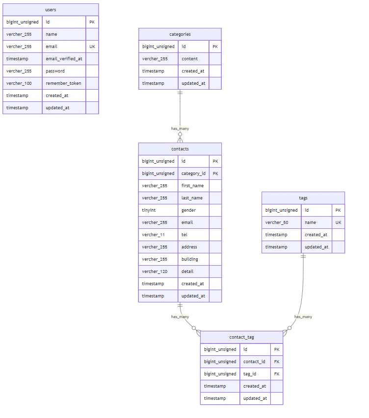

## プロジェクト名
お問い合わせフォーム

## プロジェクト概要
本プロジェクトはお問い合わせフォームのアプリケーションです.
ユーザーがフォームにて問い合わせを実施, 管理者が内容を確認できる機能を実装しています.

## ER図


## 環境構築手順
1. リポジトリをクローン
```
git clone https://github.com/yukikatori/ContactForm.git
cd contact-form-app
```
2. .envファイルの準備
.env.example をコピーして .env を作成します。
```
cp .env.example .env
```
.env ファイル内の以下のDB接続情報を確認・設定します。.env.example のデフォルト値はSail向けではないため、以下のように変更してください。
```
DB_CONNECTION=mysql
DB_HOST=mysql
DB_PORT=3306
DB_DATABASE=laravel
DB_USERNAME=sail
DB_PASSWORD=password
```

3. Composer依存パッケージのインストール
プロジェクトの初回セットアップ時は、vendor ディレクトリが存在しないため sail コマンドを使用できません。 以下のDockerコマンドを実行して、コンテナ内で composer install を実行します。
```
docker run --rm \
    -u "$(id -u):$(id -g)" \
    -v "$(pwd):/var/www/html" \
    -w /var/www/html \
    laravelsail/php82-composer:latest \
    composer install --ignore-platform-reqs
```

4. Laravel Sailの起動
以下のコマンドでDockerコンテナを起動します。
```
./vendor/bin/sail up -d
```
エイリアスの設定（推奨）
毎回 ./vendor/bin/sail と入力するのは手間なので、エイリアスを設定すると便利です。
```
alias sail='[ -f sail ] && bash sail || bash vendor/bin/sail'
```

5. アプリケーションキーの生成
```
sail artisan key:generate
```

6. データベースのマイグレーションと初期データ投入
以下のコマンドでテーブルを作成し、ダミーデータを投入します。
```
sail artisan migrate:fresh --seed
```
コンテナ内にデータが残っており、エラーが生じているケースなどがあります。 その場合は、以下のコマンドを順に実行して各コンテナを再起動して下さい。
```
sail down -v
sail up -d　//コマンド実行後にSQLコンテナが立ち上がるまで時間がかかります。30秒ほどお待ちください。
sail artisan migrate:fresh --seed
```   

7. アプリケーションへのアクセス
ブラウザで http://localhost にアクセスします。

## 使用技術
・PHP 8.5
・Laravel 10.x
・MySQL 8.4
・Nginx
・Docker / Docker Compose / Laravel Sail
・Vite（SCSS / JavaScript）
・Bootstrap 5.x
・Laravel Fortify（認証）
・phpMyAdmin

## APIエンドポイント一覧
| HTTPメソッド | URI | 説明 | 認証 |
|---------------|-----|------|------|
| GET | /api/v1/contacts | お問い合わせ一覧（検索・ページネーション付き） | 不要 |
| GET | /api/v1/contacts/{contact} | お問い合わせ詳細（カテゴリ・タグ含む） | 不要 |
| POST | /api/v1/contacts | お問い合わせ新規作成 | 不要 |
| PUT | /api/v1/contacts/{contact} | お問い合わせ更新 | 不要 |
| DELETE | /api/v1/contacts/{contact} | お問い合わせ削除 | 不要 |

## 開発環境URL
http://localhost

## 作成者
香取友樹